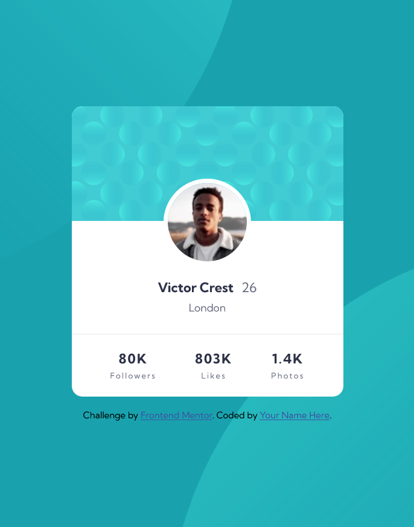
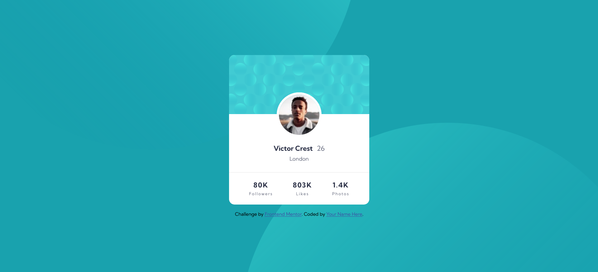

# Frontend Mentor - Profile card component solution

This is a solution to the [Profile card component challenge on Frontend Mentor](https://www.frontendmentor.io/challenges/profile-card-component-cfArpWshJ). Frontend Mentor challenges help you improve your coding skills by building realistic projects. 

## Table of contents

- [Overview](#overview)
  - [The challenge](#the-challenge)
  - [Screenshot](#screenshot)
  - [Links](#links)
- [My process](#my-process)
  - [Built with](#built-with)
  - [What I learned](#what-i-learned)
- [Author](#author)

## Overview

### The challenge

- Build out the project to the designs provided

### Screenshot




### Links

- Solution URL: [frontendmentor.io/solutions/](https://www.frontendmentor.io/solutions/mobile-first-solution-using-flex-and-backgroundimage-property-Mx2_iYpbiC)
- Live Site URL: [frontend-mentor-profile-card-component-marinabajic.vercel.app](https://frontend-mentor-profile-card-component-marinabajic.vercel.app/)

## My process

### Built with

- Semantic HTML5 markup
- CSS custom properties
- Flexbox
- Mobile-first workflow

### What I learned

```css
  background-image: url(../images/bg-pattern-top.svg), url(../images/bg-pattern-bottom.svg);
  background-repeat: no-repeat;
  background-position: right 40vw bottom 45vh, 40vw 45vh;
```

## Author

- Website - [Marina Bajic](https://marinabajic.github.io/)
- Frontend Mentor - [@MarinaBajic](https://www.frontendmentor.io/profile/MarinaBajic)
